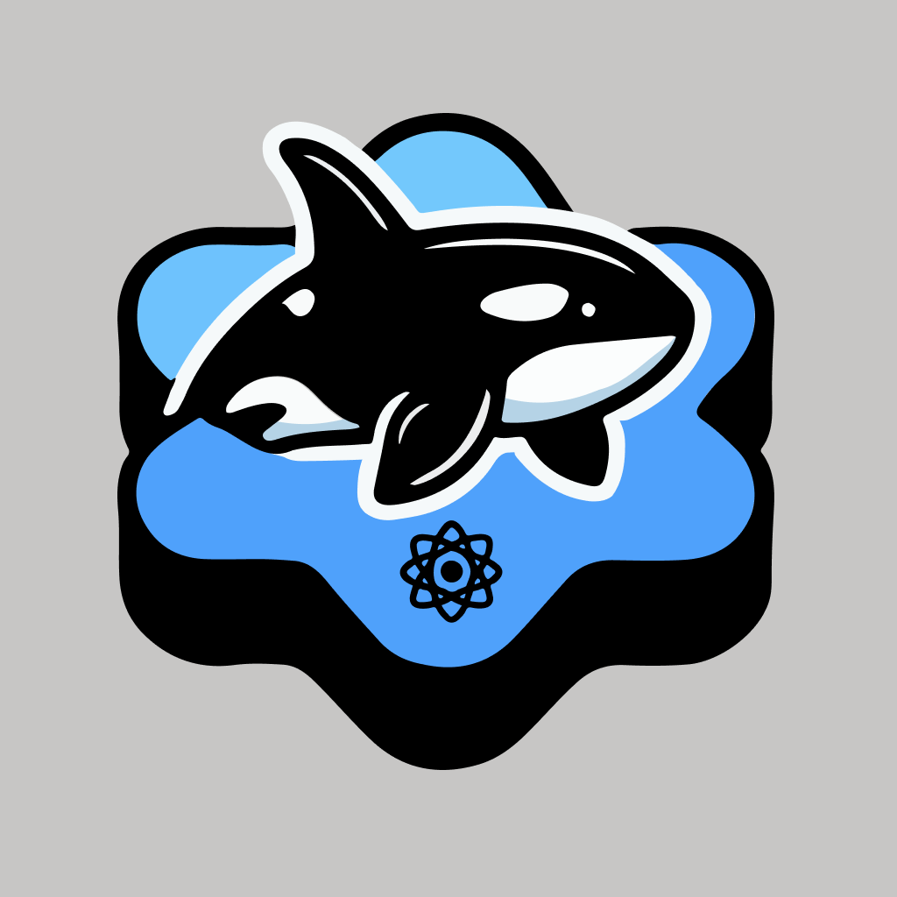

<div align="center">
  
  
  # Native Tide Starter Kit

A CLI tool to quickly scaffold a new React Native project using the Native Tide starter template.

</div>

> **⚠️ Early Version Warning**: This package is still in a very early version and is not stable. Use at your own risk. Some features may be incomplete or subject to change.

## Demo

### RTL Support Without App Refresh

Watch how the app seamlessly switches between RTL (Right-to-Left) and LTR (Left-to-Right) layouts without requiring an app refresh:

<video src="assets/demo.mp4" controls width="100%">
  Your browser does not support the video tag. [Download the demo video](assets/demo.mp4)
</video>

The demo showcases the dynamic RTL/LTR language switching feature that updates the entire UI layout instantly.

## Installation

```bash
npm install -g native-tide-starter-kit
```

Or use with npx (no installation needed):

```bash
npx native-tide-starter-kit
```

## Usage

Run the CLI command:

```bash
native-tide-starter-kit
```

Or use the shorter alias:

```bash
create-native-tide
```

The CLI will prompt you for:

- **App Name**: The name of your application
- **Styling Solution**: Choose between Unistyles or NativeWind
- **Project Directory**: Where to create the project (defaults to the slugified app name)

## What Gets Created

The CLI creates a complete React Native project with:

- ✅ Expo Router setup with file-based routing
- ✅ TypeScript configuration
- ✅ Internationalization (i18n) setup
- ✅ Zustand for state management
- ✅ ESLint and Prettier configuration
- ✅ Custom hooks and utilities
- ✅ Theme system with light/dark/system modes
- ✅ **RTL (Right-to-Left) language support** - Switch languages dynamically without app refresh (see demo above)
- ✅ **Styling Solution**: Choose between Unistyles or NativeWind
  - **Unistyles**: Runtime theming with TypeScript support
  - **NativeWind**: Tailwind CSS for React Native

## Next Steps

After creating your project:

```bash
cd your-project-name
yarn install
yarn start
```

## Features

- **Dynamic Theme System**: 8 beautiful themes to choose from
- **Type-Safe**: Fully typed theme definitions
- **Styling Options**: Choose between Unistyles or NativeWind
  - **Unistyles**: Runtime theming, breakpoints, and adaptive themes
  - **NativeWind**: Tailwind CSS utility classes for React Native
- **Internationalization**: Multi-language support with i18n
- **Navigation**: Expo Router for file-based routing
- **State Management**: Zustand store setup
- **Linting**: ESLint and Prettier setup

## Local Development & Testing

To test the CLI locally before publishing:

1. **Install dependencies**:

   ```bash
   yarn install
   ```

2. **Link the package locally** (for global testing):

   ```bash
   yarn link
   ```

   Then you can use `native-tide-starter-kit` or `create-native-tide` commands globally.

3. **Or test directly with node**:

   ```bash
   node bin/cli.js
   ```

4. **Or use npm link** (alternative to yarn link):

   ```bash
   npm link
   ```

5. **Test in a temporary directory**:

   ```bash
   cd /tmp
   mkdir test-project
   cd test-project
   native-tide-starter-kit
   # or
   create-native-tide
   ```

6. **Unlink when done testing**:
   ```bash
   yarn unlink
   # or
   npm unlink -g native-tide-starter-kit
   ```

## License

MIT
